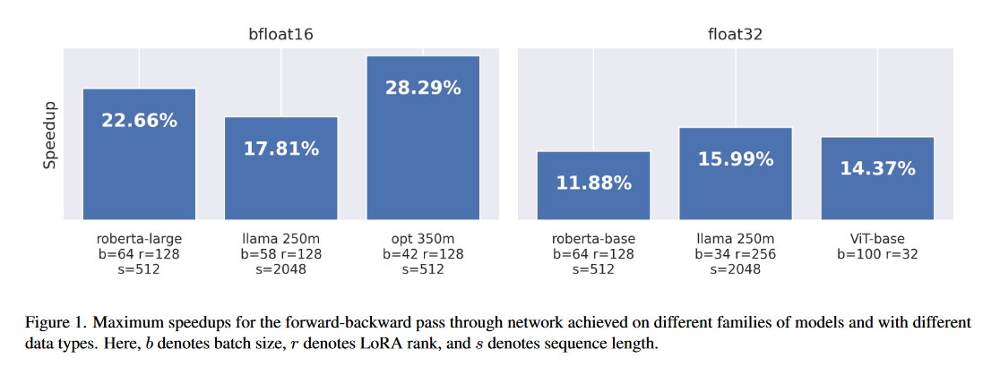

# 🏃 RunLoRA:  Framework for optimized LoRA implementations
## Based on paper: [Run LoRA Run: Faster and Lighter LoRA Implementations](https://arxiv.org/abs/2312.03415)

> LoRA is a technique that reduces the number of trainable parameters in a neural network by introducing low-rank adapters to linear layers. This technique is used both for fine-tuning and full training of large language models. This paper presents the RunLoRA framework for efficient implementations of LoRA that significantly improves the speed of neural network training and fine-tuning using low-rank adapters. The proposed implementation optimizes the computation of LoRA operations based on dimensions of corresponding linear layer, layer input dimensions and lora rank by choosing best forward and backward computation graph based on FLOPs and time estimations, resulting in faster training without sacrificing accuracy. The experimental results show from 10 to 28% speedup on various transformer models.

## Run Experiments

Example usage of the becnhmarking script: 
```
python3 experiments/model_exp.py -m configs/llama_60m.json \
        --target_modules q_proj v_proj k_proj o_proj up_proj down_proj gate_proj \
        --criterions flops --n_batch 10 --min_run_time 20 -r 8 --dtype 'bf16'
```

or just use the ExperimentLauncher notebook to run the experiments featured in the paper. 

For experiments on visual transformer models, use BenchmarkViT and FineTuneViT_RunLoRA notebooks.

## Results



